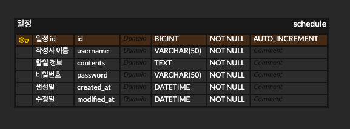
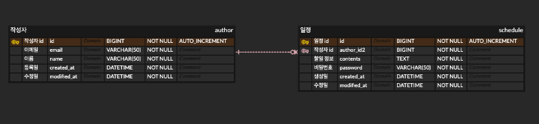

# KakaoTechCampusAssignment2

## Lv.0~2 ERD Diagram


## Lv.3~6 ERD Diagram


# 일정 관리 API 명세서

---

# 일정 작성

## URL

**`POST` /api/schedules**

## Request Body

| **Name** | **Type** | **Required** | **Description** |
| --- | --- | --- | --- |
| username | string | ✅ | 작성자명 |
| contents | string | ✅ | 할일 |
| password | string | ✅ | 비밀번호 |

### **Example**

```json
{
  "username": "username1",
  "contents": "contents test",
  "password": "1234"
}
```

## Response

### Success

|  **Name** | **Type** | **Required** | Description |
| --- | --- | --- | --- |
| id | long | ✅ | 고유 식별자 |
| username | string | ✅ | 저장된 작성자명 |
| contents | string | ✅ | 저장된 할일 정보 |

### **Example**

```json
HTTP Status - 201 (Created)

{
	"id": 1,
	"username": "username1",
	"contents": "contents test"
}
```

### Fail

| **Name** | **Type** | **Required** | **Description** |
| --- | --- | --- | --- |
| message | string | ✅ | 에러 메시지 |

### **Example**

내부 서버 에러

```json
HTTP Status - 500 (Internal Server Error)

{
  "message": "Internal Server Error"
}
```

---

# 전체 일정 조회

- 수정일 기준 내림차순으로 정렬하여 조회

## URL

**`GET` /api/schedules**

## Request Param

| **Name** | **Type** | **Required** | **Description** |
| --- | --- | --- | --- |
| modifiedAt | string | ❌ | 수정일 (`YYYY-MM-DD`) |
| username | string | ❌ | 작성자명 |

### **Example**

**`GET` /api/schedules?username=user1&modifiedAt=2025-05-21**

## Response

### Success

|  **Name** | **Type** | **Required** | Description |
| --- | --- | --- | --- |
| id | long | ✅ | 고유 식별자 |
| username | string | ✅ | 작성자명 |
| contents | string | ✅ | 할일 정보 |
| createdAt | string | ✅ | 생성일 |
| modifiedAt | string | ✅ | 수정일 |

### **Example**

```json
HTTP Status - 200 (OK)

{
	{
		"id": 1,
		"username": "user1",
		"contents": "contents1",
		"createdAt": "2025-05-21T18:16:23",
		"modifiedAt": "2025-05-21T18:16:23"
	},
	{
		"id": 5,
		"username": "user5",
		"contents": "contents5",
		"createdAt": "2025-05-21T18:14:23",
		"modifiedAt": "2025-05-21T18:14:23"
	},
	...
	{
		"id": 12,
		"username": "user12",
		"contents": "contents12",
		"createdAt": "2025-05-21T18:12:23",
		"modifiedAt": "2025-05-21T18:12:23"
	}
}
```

### Fail

| **Name** | **Type** | **Required** | **Description** |
| --- | --- | --- | --- |
| message | string | ✅ | 에러 메시지 |

### **Example**

잘못된 날짜 형식

```json
HTTP Status - 400 (Bad Request)

{
    "message": "Invalid Date Format. Please Use YYYY-MM-DD"
}
```

내부 서버 에러

```json
HTTP Status - 500 (Internal Server Error)

{
  "message":"Internal Server Error"
}
```

---

# 선택 일정 조회

## URL

**`GET` /api/schedules/${id}**

### **Example**

**`GET` /api/schedules/3**

## Response

### Success

|  **Name** | **Type** | **Required** | Description |
| --- | --- | --- | --- |
| id | long | ✅ | 고유 식별자 |
| username | string | ✅ | 작성자명 |
| contents | string | ✅ | 할일 정보 |
| createdAt | string | ✅ | 생성일 |
| modifiedAt | string | ✅ | 수정일 |

### **Example**

```json
HTTP Status - 200 (OK)

{
	"id": 1,
	"username": "user1",
	"contents": "contents1",
	"createdAt": "2025-05-13T21:00:00",
	"modifiedAt": "2025-05-13T21:00:00"
}
```

### Fail

| **Name** | **Type** | **Required** | **Description** |
| --- | --- | --- | --- |
| message | string | ✅ | 에러 메시지 |

### **Example**

존재하지 않는 일정 id

```json
HTTP Status - 404 (Not Found)

{
  "message": "Schedule Not Found"
}
```

내부 서버 에러

```json
HTTP Status - 500 (Internal Server Error)

{
  "message":"Internal Server Error"
}
```

---

# 선택 일정 수정

- 선택한 일정 중 할일, 작성자명 만 수정 가능

## URL

**`PATCH` /api/schedules/${id}**

## Request Body

| **Name** | **Type** | **Required** | **Description** |
| --- | --- | --- | --- |
| password | string | ✅ | 비밀번호 |
| username | string | ❌ | 할일 |
| contents | string | ❌ | 작성자명 |

## Response

### Success

|  **Name** | **Type** | **Required** | Description |
| --- | --- | --- | --- |
| id | long | ✅ | 고유 식별자 |
| username | string | ✅ | 작성자명 |
| contents | string | ✅ | 할일 정보 |
| createdAt | string | ✅ | 생성일 |
| modifiedAt | string | ✅ | 수정일 |

### **Example**

```json
HTTP Status - 200 (OK)

{
	"id": 1,
	"username": "user1",
	"contents": "contents1",
	"createdAt": "2025-05-13T21:00:00",
	"modifiedAt": "2025-05-15T21:00:00",
}
```

### Fail

| **Name** | **Type** | **Required** | **Description** |
| --- | --- | --- | --- |
| message | string | ✅ | 에러 메시지 |

### **Example**

존재하지 않는 일정 id

```json
HTTP Status - 404 (Not Found)

{
  "message": "Schedule Not Found"
}
```

수정할 항목이 없음

```json
HTTP Status - 400 (Bad Request)
{
	"message": "Nothing to Update"
}
```

비밀번호 불일치

```json
HTTP Status - 401 (Unauthorized)
{
	"message": "Password Do Not Match"
}
```

내부 서버 에러

```json
HTTP Status - 500 (Internal Server Error)

{
  "message":"Internal Server Error"
}
```

---

# 선택 일정 삭제

## URL

**`DELETE` /api/schedules/${id}**

## Request Body

| **Name** | **Type** | **Required** | **Description** |
| --- | --- | --- | --- |
| password | string | ✅ | 비밀번호 |

## Response

### Success

### **Example**

```json
HTTP Status - 200 (OK)
```

### Fail

| **Name** | **Type** | **Required** | **Description** |
| --- | --- | --- | --- |
| message | string | ✅ | 에러 메시지 |

### **Example**

존재하지 않는 일정 id

```json
HTTP Status - 404 (Not Found)

{
  "message": "Schedule Not Found"
}
```

비밀번호 불일치

```json
HTTP Status - 401 (Unauthorized)
{
	"message": "Password Do Not Match"
}
```

내부 서버 에러

```json
HTTP Status - 500 (Internal Server Error)

{
  "message":"Internal Server Error"
}
```

---

---

# Lv3_6 작성자 등록

## URL

**`POST` /api/authors**

## Request Body

| **Name** | **Type** | **Required** | **Description** |
| --- | --- | --- | --- |
| email | string | ✅ | 작성자 이름 |
| name | string | ✅ | 작성자 이메일 (형식 검증, 중복 불가) |

### Example

```json
{
	"name": "song",
	"email": "song@naver.com"
}
```

## Response

### Success

| **Name** | **Type** | **Required** | **Description** |
| --- | --- | --- | --- |
| id | long | ✅ | 작성자 식별자 id |
| email | string | ✅ | 작성자 이메일 |
| name | string | ✅ | 작성자 이름 |

### **Example**

```json
HTTP Status - 201 (Created)

{
    "id": 36,
    "email": "Email@gmail.com",
    "name": "name1"
}
```

### Fail

| **Name** | **Type** | **Required** | **Description** |
| --- | --- | --- | --- |
| message | string | ✅ | 에러 메시지 |

### **Example**

유효성 검증 실패

```json
HTTP Status - 400 (Bad Request)

{
    "name": "Name Is Required",
    "email": "Email Is Required"
}
```

이메일 중복

```json
HTTP Status - 409 (Conflict)

{
    "message": "Already Registered Email"
}
```

이메일 형식 오류

```json
HTTP Status - 400 (Bad Request)

{
    "email": "Proper Email Format Is Required"
}
```

정의되지 않는 필드 포함

```json
HTTP Status - 400 (Bad Request)

{
    "message": "Contains field that is not allowed"
}
```

내부 서버 에러

```json
HTTP Status - 500 (Internal Server Error)

{
	  "message":"Internal Server Error"
}
```

---

# Lv3_6  일정 등록

## URL

**`POST` /api/schedules**

## Request Body

| **Name** | **Type** | **Required** | **Description** |
| --- | --- | --- | --- |
| authorId | long | ✅ | 작성자 식별자 ID |
| contents | string | ✅ | 할 일 (최대 200자) |
| password | string | ✅ | 비밀번호 |

### Example

```json
{
    "authorId": 41,
    "contents": "hihi",
    "password": "1234"
}
```

## Response

### Success

| **Name** | **Type** | **Required** | **Description** |
| --- | --- | --- | --- |
| id | long | ✅ | 일정 식별자 ID |
| authorId | long | ✅ | 작성자 식별자 ID |
| contents | string | ✅ | 할일 |

### **Example**

```json
HTTP Status - 201 (Created)

{
	"id": 4,
	"authorId": 41,
	"contents": "hihi"
}
```

### Fail

| **Name** | **Type** | **Required** | **Description** |
| --- | --- | --- | --- |
| message | string | ✅ | 에러 메시지 |

### **Example**

유효성 검증 실패

```json
HTTP Status - 400 (Bad Request)

{
    "password": "Password is Required",
    "contents": "Contents is Required",
    "authorId": "Author ID is Required"
}
```

존재하지 않는 작성자

```json
HTTP Status - 404 (Not Found)

{
    "message": "Author Not Found"
}
```

정의되지 않는 필드 포함

```json
HTTP Status - 400 (Bad Request)
{
    "message": "Contains field that is not allowed"
}
```

할일 200자 초과

```json
HTTP Status - 400 (Bad Request)
{
    "contents": "Contents are limited to 200 characters"
}
```

내부 서버 에러

```json
HTTP Status - 500 (Internal Server Error)

{
	  "message":"Internal Server Error"
}
```

---

# Lv3_6  일정 조회

## URL

**`GET` /api/schedules**

## Request Parameters

| **Name** | **Type** | **Required** | **Description** |
| --- | --- | --- | --- |
| authorId | long | ❌ | 작성자 식별자 ID |
| modifiedAt | string | ❌ | 수정일 (`YYYY-MM-DD`) |

### Example

GET /api/schedules?authorId=1&modifiedAt=2025-05-24

## Response

### Success

| **Name** | **Type** | **Required** | **Description** |
| --- | --- | --- | --- |
| authorId | long | ✅ | 작성자 식별자 ID |
| name | long | ✅ | 작성자 이름 |
| email | string | ✅ | 작성자 이메일 |
| contents | string | ✅ | 할일 |
| createdAt | string | ✅ | 할일 생성일 |
| modifiedAt | string | ✅ | 할일 수정일 |

### **Example**

```json
HTTP Status - 200 (Ok)

[
    {
        "authorId": 17,
        "name": "song123",
        "email": "test@naver.com",
        "contents": "contents Test",
        "createdAt": "2025-05-25T02:27:15",
        "modifiedAt": "2025-05-25T02:27:15"
    },
    {
        "authorId": 41,
        "name": "songsong",
        "email": "1tm23ddn@naver.com",
        "contents": "hihi",
        "createdAt": "2025-05-25T01:43:36",
        "modifiedAt": "2025-05-25T01:43:36"
    },
   ...
]
```

### Fail

| **Name** | **Type** | **Required** | **Description** |
| --- | --- | --- | --- |
| message | string | ✅ | 에러 메시지 |

### **Example**

존재하지 않는 작성자

```json
HTTP Status - 404 (Not Found)

{
    "message": "Author Not Found"
}
```

잘못된 날짜 형식

```json
HTTP Status - 400 (Bad Request)
{
    "message": "Invalid Date Format. Please Use YYYY-MM-DD"
}
```

내부 서버 에러

```json
HTTP Status - 500 (Internal Server Error)

{
	  "message":"Internal Server Error"
}
```

---

# Lv3_6  일정 수정

## URL

**`PATCH` /api/schedules/{id}**

## Path Variable

| **Name** | **Type** | **Required** | **Description** |
| --- | --- | --- | --- |
| id | long | ✅ | 할일 식별자 ID |

## Request Body

| **Name** | **Type** | **Required** | **Description** |
| --- | --- | --- | --- |
| password | string | ✅ | 비밀번호 |
| contents | string | ✅ | 할일 |

### Example

```json
{
    "password": "1234",
    "contents": "modify contents"
}
```

## Response

### Success

| **Name** | **Type** | **Required** | **Description** |
| --- | --- | --- | --- |
| id | long | ✅ | 할일 식별자 ID |
| authorId | long | ✅ | 작성자 식별자 ID |
| contents | string | ✅ | 수정된 할일 |
| createdAt | string | ✅ | 할일 생성일 |
| modifiedAt | string | ✅ | 할일 수정일 |

### **Example**

```json
HTTP Status - 200 (Ok)

{
    "id": 2,
    "authorId": 41,
    "contents": "modify contents",
    "createdAt": "2025-05-25T01:36:43",
    "modifiedAt": "2025-05-25T03:45:34.266585"
}
```

### Fail

| **Name** | **Type** | **Required** | **Description** |
| --- | --- | --- | --- |
| message | string | ✅ | 에러 메시지 |

### **Example**

존재하지 않는 할일

```json
HTTP Status - 404 (Not Found)
{
    "message": "Schedule Not Found"
}
```

비밀번호 불일치

```json
HTTP Status - 401 (Unauthorized)
{
    "message": "Password Do Not Match"
}
```

유효성 검증 실패

```json
HTTP Status - 400 (Bad Request)
{
    "password": "Password is Required",
    "contents": "Contents is Required"
}
```

내부 서버 에러

```json
HTTP Status - 500 (Internal Server Error)

{
	  "message":"Internal Server Error"
}
```

---

# Lv3_6  일정 삭제

## URL

**`DELETE` /api/schedules/{id}**

## Path Variable

| **Name** | **Type** | **Required** | **Description** |
| --- | --- | --- | --- |
| id | long | ✅ | 할일 식별자 ID |

## Request Body

| **Name** | **Type** | **Required** | **Description** |
| --- | --- | --- | --- |
| password | string | ✅ | 비밀번호 |

### Example

```json
{
    "password": "1234"
}
```

## Response

### Success

### **Example**

```json
HTTP Status - 200 (Ok)
```

### Fail

| **Name** | **Type** | **Required** | **Description** |
| --- | --- | --- | --- |
| message | string | ✅ | 에러 메시지 |

### **Example**

존재하지 않는 할일

```json
HTTP Status - 404 (Not Found)

{
    "message": "Schedule Not Found"
}
```

비밀번호 불일치

```json
HTTP Status - 401 (Unauthorized)

{
    "message": "Password Do Not Match"
}
```

유효성 검증 실패

```json
HTTP Status - 400 (Bad Request)
{
    "password": "Password is Required"
}
```

내부 서버 에러

```json
HTTP Status - 500 (Internal Server Error)

{
	  "message":"Internal Server Error"
}
```

---

# Lv3_6  페이지네이션

## URL

**`GET` /api/schedules/paging**

## Request Parameters

| **Name** | **Type** | **Required** | **Description** | **Default** |
| --- | --- | --- | --- | --- |
| page | int | ❌ | 조회할 페이지 번호 | 1 |
| size | int | ❌ | 한 페이지에 포함될 항목 수 | 10 |

### Example

**localhost:8080/api/schedules/paging?page=1&size=10**

## Response

### Success

### **Example**

```json
HTTP Status - 200 (Ok)

[
    {
        "authorId": 5,
        "name": "User Five",
        "email": "user5@example.com",
        "contents": "할 일 20",
        "createdAt": "2025-05-20T14:30:00",
        "modifiedAt": "2025-05-23T15:30:00"
    },
    {
        "authorId": 4,
        "name": "User Four",
        "email": "user4@example.com",
        "contents": "할 일 19",
        "createdAt": "2025-05-19T13:15:00",
        "modifiedAt": "2025-05-22T14:15:00"
    },
	...
]
```

### Fail

| **Name** | **Type** | **Required** | **Description** |
| --- | --- | --- | --- |
| message | string | ✅ | 에러 메시지 |

### **Example**

page or size 음수값 요청

```json
HTTP Status - 400 (Bad Request)
{
    "message": "page and size must be greater than or equal to 0"
}
```

내부 서버 에러

```json
HTTP Status - 500 (Internal Server Error)

{
	  "message":"Internal Server Error"
}
```

---
